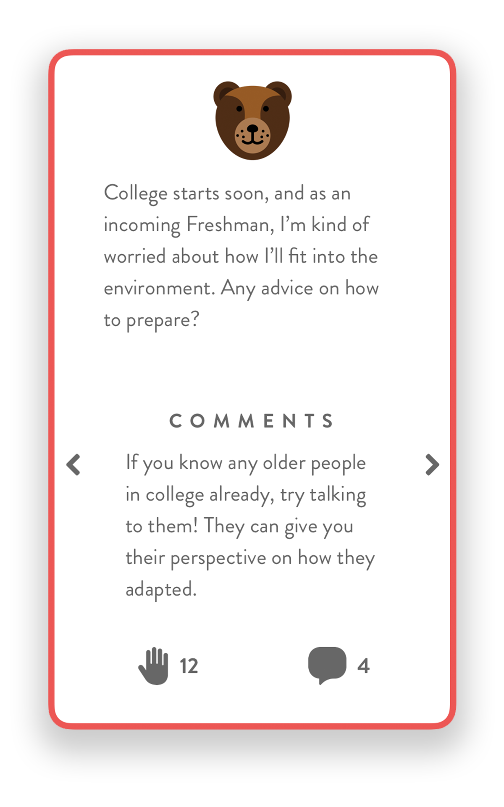

# table

Table is a social platform built using the MERN stack (MongoDB, Express, React, Node). The goal is to let users be anonymously open about any personal issues they have while being in a judgement-free zone.

Like a forum, users can view other posts (or tables), reply to them, and/or upvote them to provide support for each other.

